# GitOps for PE Module 2

## Page 1

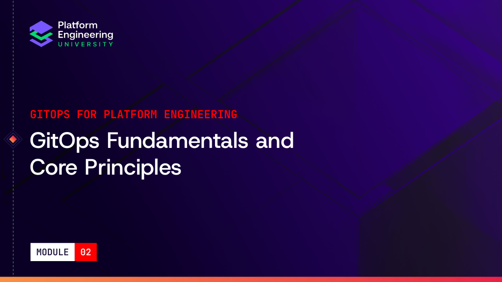

GitOps Fundamentals and 
Core Principles
 
GITOPS FOR PLATFORM ENGINEERING
MODULE 02

## Page 2

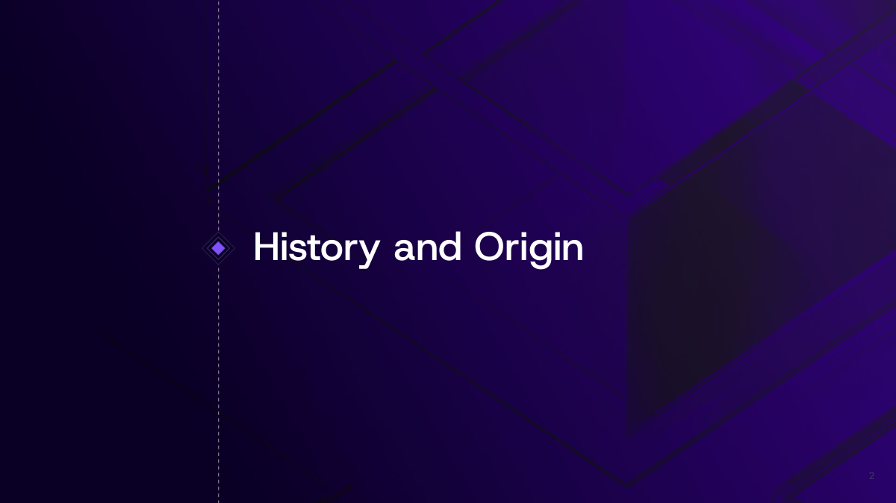

History and Origin
2

## Page 3

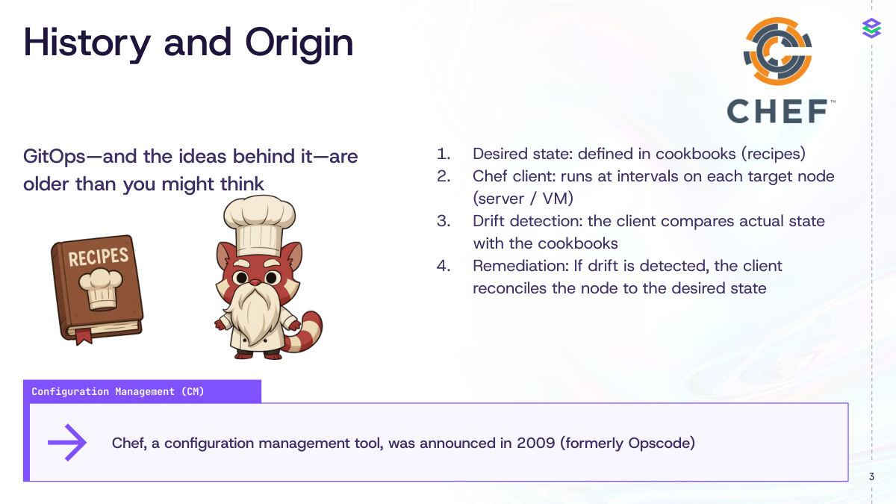

History and Origin
1. Desired state: defined in cookbooks (recipes)
2. Chef client: runs at intervals on each target node 
(server / VM)
3. Drift detection: the client compares actual state 
with the cookbooks
4. Remediation: If drift is detected, the client 
reconciles the node to the desired state
GitOps—and the ideas behind it—are 
older than you might think
Configuration Management (CM)
Chef, a configuration management tool, was announced in 2009 (formerly Opscode)
3

## Page 4

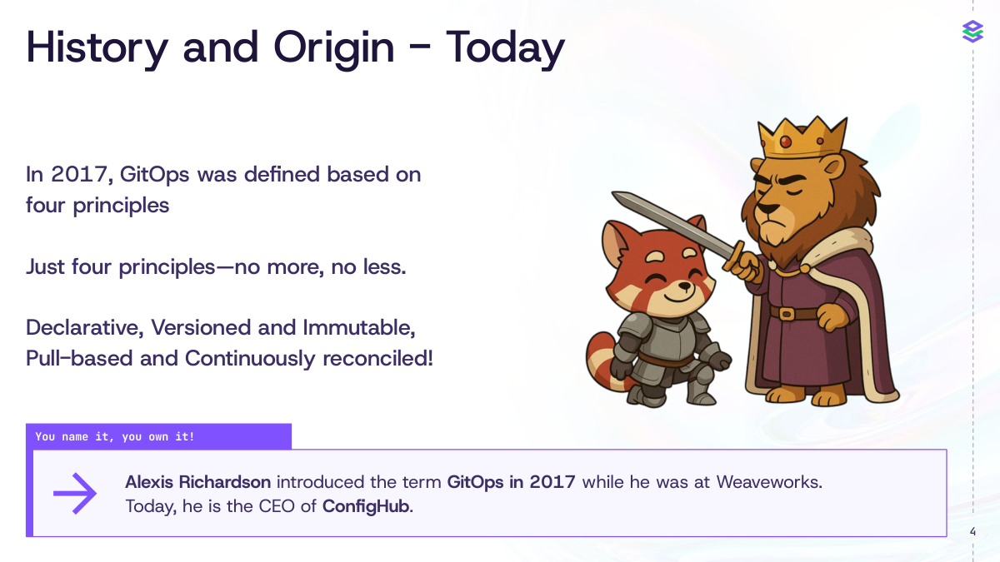

History and Origin - Today
In 2017, GitOps was defined based on 
four principles
Just four principles—no more, no less.
Declarative, Versioned and Immutable, 
Pull-based and Continuously reconciled!   
You name it, you own it!
Alexis Richardson introduced the term GitOps in 2017 while he was at Weaveworks. 
Today, he is the CEO of ConfigHub.
4

## Page 5

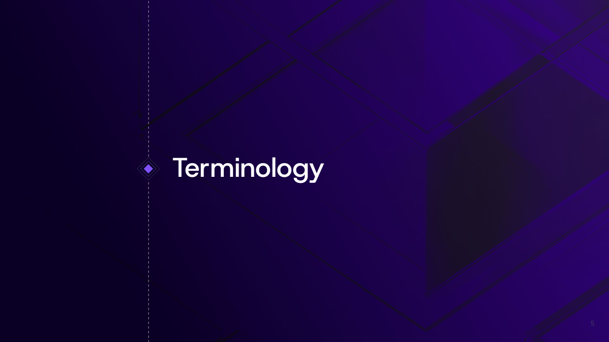

Terminology
5

## Page 6

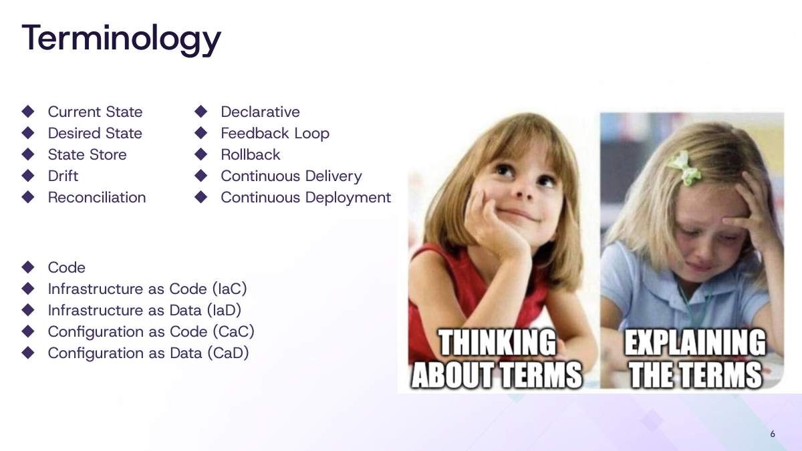

6
◆ Current State
◆ Desired State
◆ State Store
◆ Drift
◆ Reconciliation
◆ Code
◆ Infrastructure as Code (IaC)
◆ Infrastructure as Data (IaD)
◆ Configuration as Code (CaC)
◆ Configuration as Data (CaD)
◆ Declarative
◆ Feedback Loop
◆ Rollback
◆ Continuous Delivery
◆ Continuous Deployment
Terminology

## Page 7

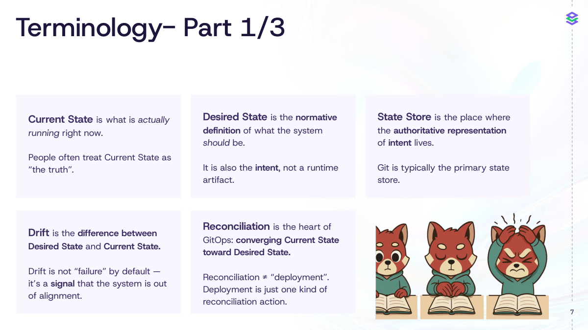

7
Terminology- Part 1/3
Current State is what is actually 
running right now.
People often treat Current State as 
“the truth”.
Desired State is the normative 
definition of what the system 
should be.
It is also the intent, not a runtime 
artifact.
State Store is the place where 
the authoritative representation 
of intent lives. 
Git is typically the primary state 
store.
Drift is the difference between 
Desired State and Current State.
Drift is not “failure” by default — 
it’s a signal that the system is out 
of alignment.
Reconciliation is the heart of 
GitOps: converging Current State 
toward Desired State.
Reconciliation ≠ “deployment”.
Deployment is just one kind of 
reconciliation action.

## Page 8

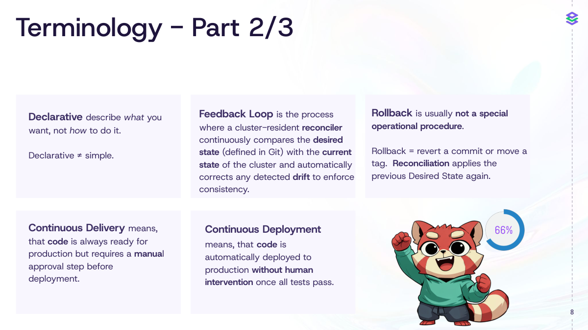

8
Declarative describe what you 
want, not how to do it.
Declarative ≠ simple.
Feedback Loop is the process 
where a cluster-resident reconciler 
continuously compares the desired 
state (defined in Git) with the current 
state of the cluster and automatically 
corrects any detected drift to enforce 
consistency.
Rollback is usually not a special 
operational procedure. 
Rollback = revert a commit or move a 
tag.  Reconciliation applies the 
previous Desired State again.
Continuous Delivery means, 
that code is always ready for 
production but requires a manual 
approval step before 
deployment.
Continuous Deployment 
means, that code is 
automatically deployed to 
production without human 
intervention once all tests pass.
Terminology - Part 2/3

## Page 9

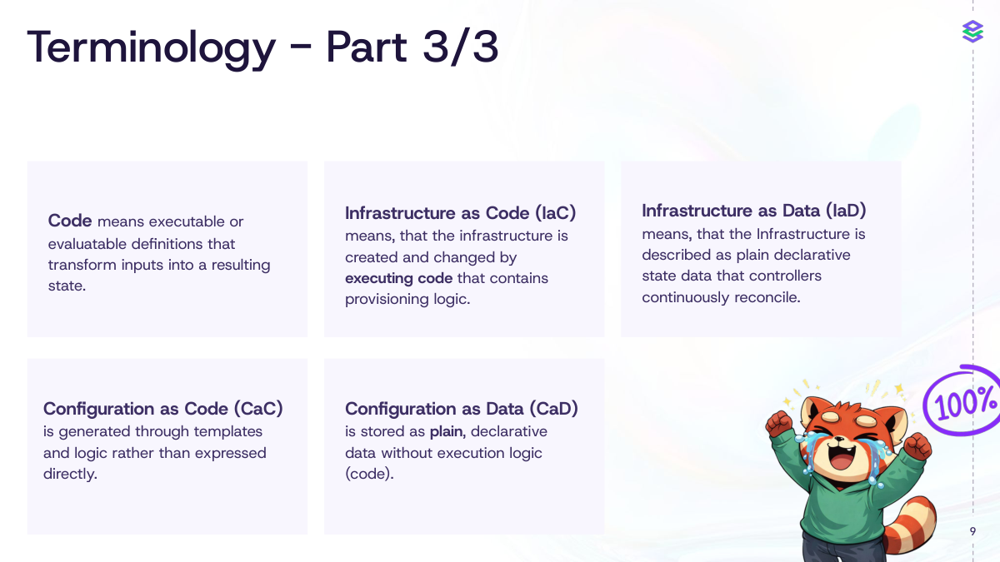

9
Terminology - Part 3/3
Code means executable or 
evaluatable definitions that 
transform inputs into a resulting 
state.
Infrastructure as Code (IaC) 
means, that the infrastructure is 
created and changed by 
executing code that contains 
provisioning logic.
Infrastructure as Data (IaD) 
means, that the Infrastructure is 
described as plain declarative 
state data that controllers 
continuously reconcile.
Configuration as Code (CaC) 
is generated through templates 
and logic rather than expressed 
directly.
Configuration as Data (CaD) 
is stored as plain, declarative 
data without execution logic 
(code).

## Page 10

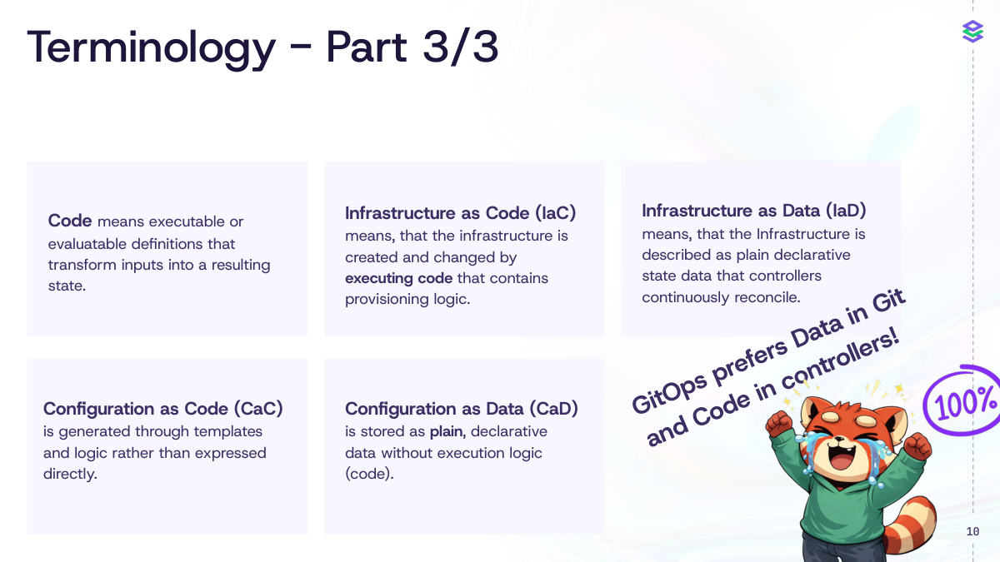

10
Terminology - Part 3/3
Code means executable or 
evaluatable definitions that 
transform inputs into a resulting 
state.
Infrastructure as Code (IaC) 
means, that the infrastructure is 
created and changed by 
executing code that contains 
provisioning logic.
Infrastructure as Data (IaD) 
means, that the Infrastructure is 
described as plain declarative 
state data that controllers 
continuously reconcile.
Configuration as Code (CaC) 
is generated through templates 
and logic rather than expressed 
directly.
Configuration as Data (CaD) 
is stored as plain, declarative 
data without execution logic 
(code).
GitOps prefers Data in Git 
and Code in controllers!

## Page 11

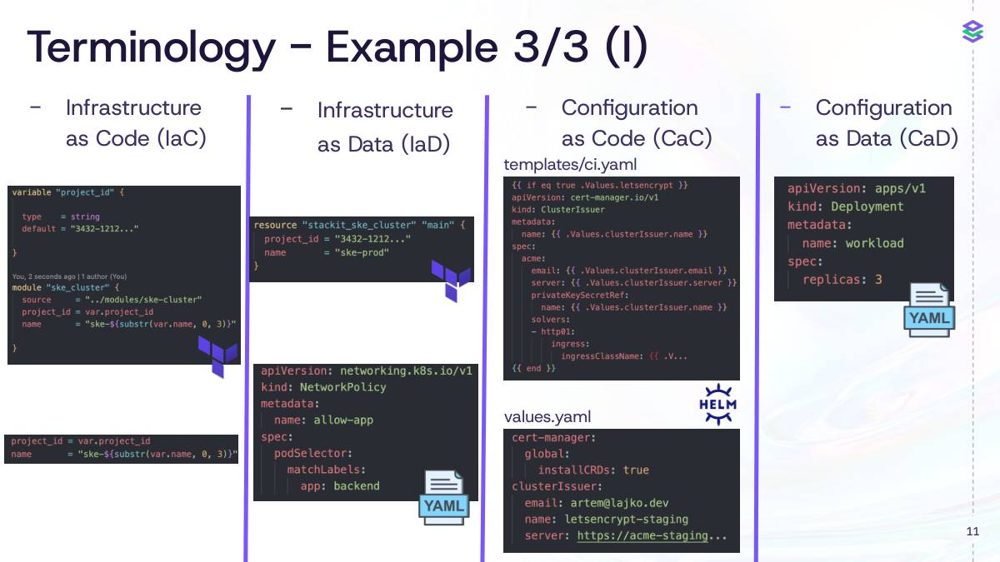

11
Terminology - Example 3/3 (I)
- Infrastructure 
as Code (IaC)
- Infrastructure 
as Data (IaD) 
- Configuration 
as Code (CaC)
- Configuration  
as Data (CaD) 
templates/ci.yaml
values.yaml

## Page 12

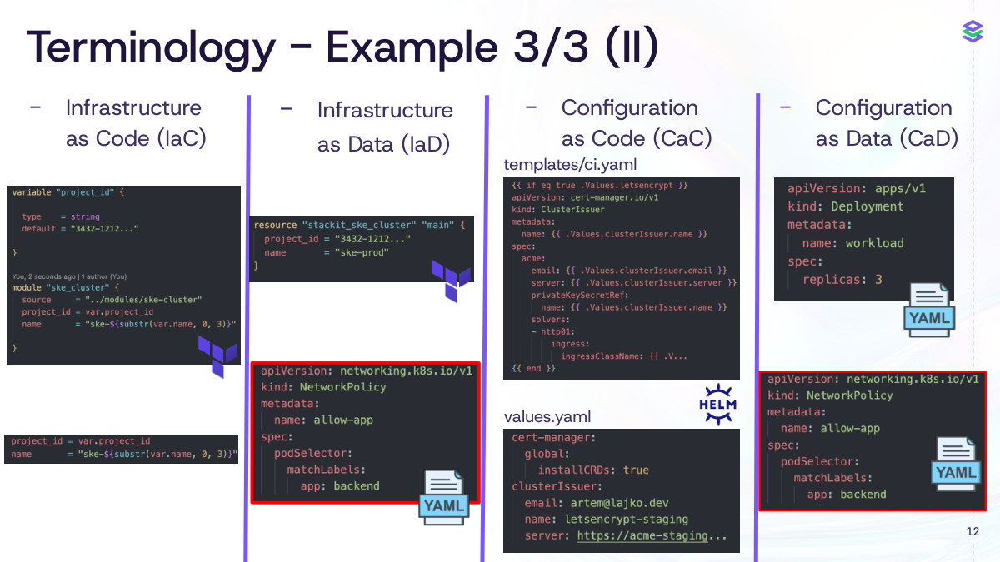

12
Terminology - Example 3/3 (II)
- Infrastructure 
as Code (IaC)
- Infrastructure 
as Data (IaD) 
- Configuration 
as Code (CaC)
- Configuration  
as Data (CaD) 
templates/ci.yaml
values.yaml

## Page 13

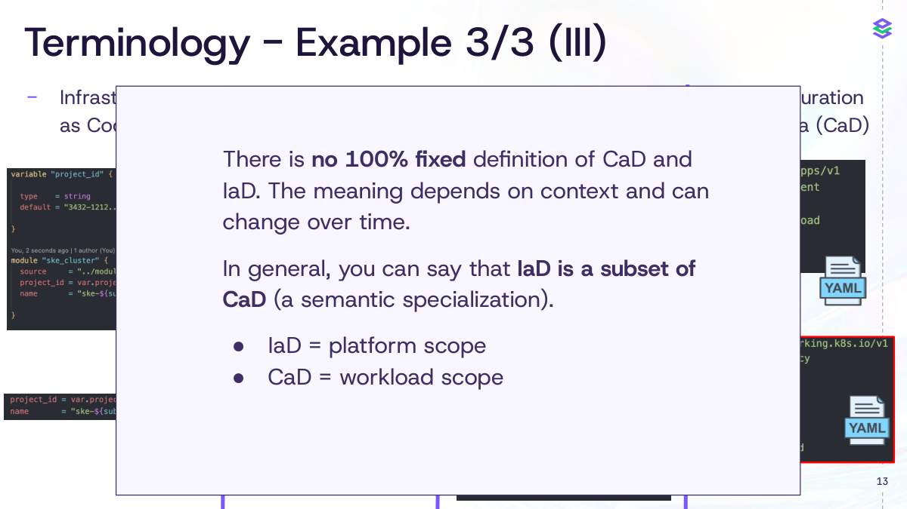

13
Terminology - Example 3/3 (III)
- Infrastructure 
as Code (IaC)
- Infrastructure 
as Data (IaD) 
- Configuration 
as Code (CaC)
- Configuration  
as Data (CaD) 
templates/ci.yaml
values.yaml
There is no 100% fixed definition of CaD and 
IaD. The meaning depends on context and can 
change over time.
In general, you can say that IaD is a subset of 
CaD (a semantic specialization).
● IaD = platform scope
● CaD = workload scope

## Page 14

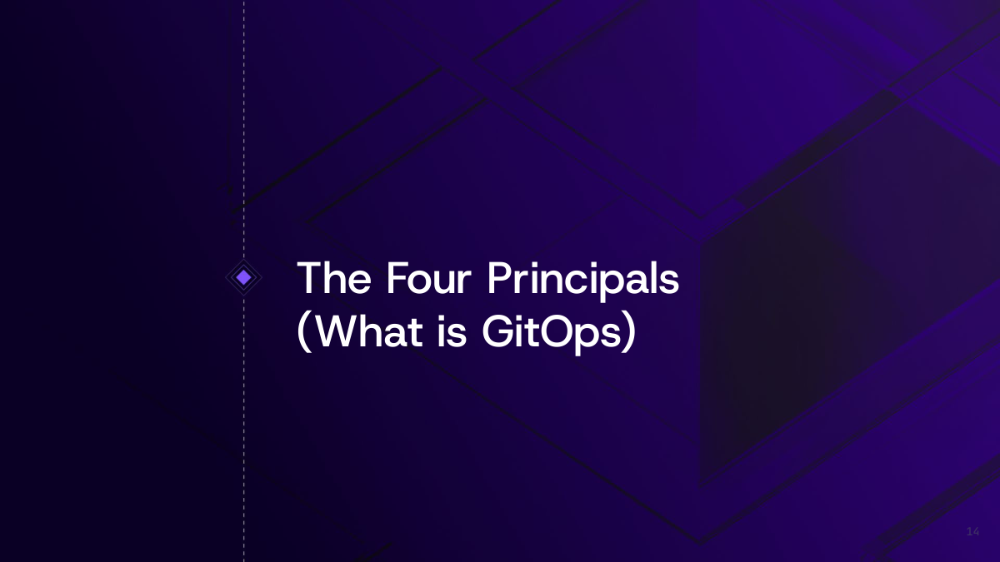

The Four Principals 
(What is GitOps)
14

## Page 15

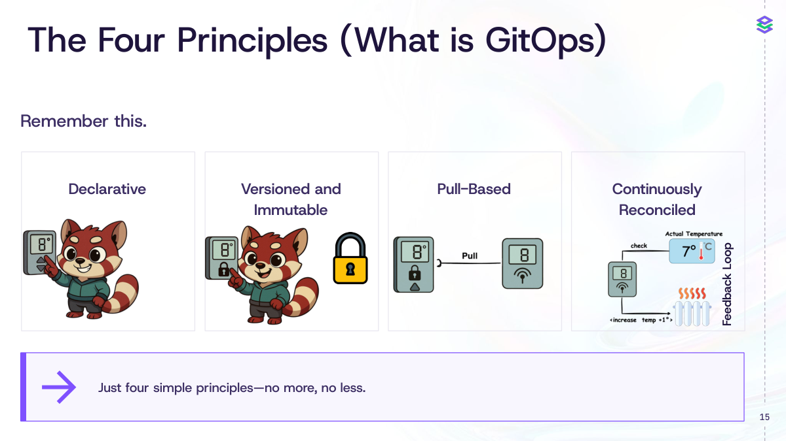

Remember this.
Declarative Versioned and 
Immutable
Pull-Based
Just four simple principles—no more, no less. 
15
Continuously 
Reconciled
The Four Principles (What is GitOps)
Feedback Loop

## Page 16

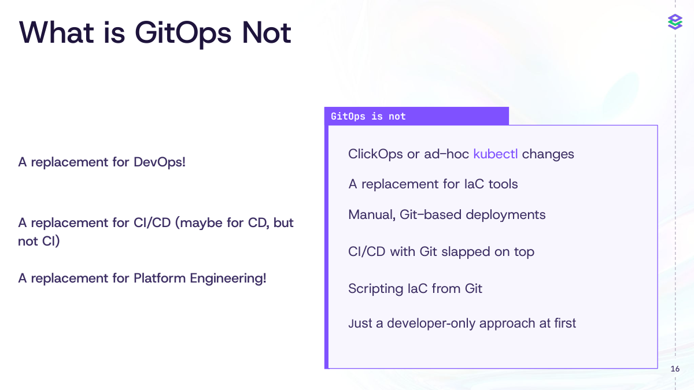

What is GitOps Not
ClickOps or ad-hoc kubectl changes
A replacement for IaC tools
Manual, Git-based deployments
CI/CD with Git slapped on top
Scripting IaC from Git
Just a developer-only approach at first
A replacement for DevOps! 
A replacement for CI/CD (maybe for CD, but 
not CI)
A replacement for Platform Engineering!
16
GitOps is not

## Page 17

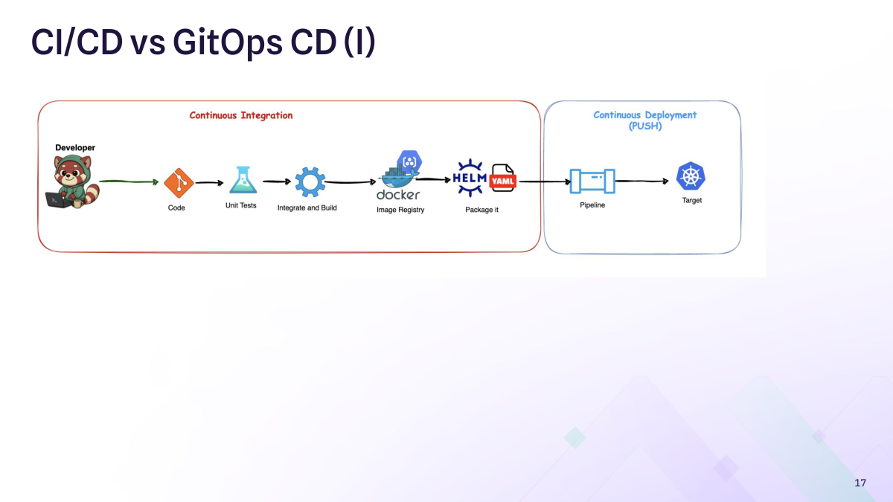

17
CI/CD vs GitOps CD (I)

## Page 18

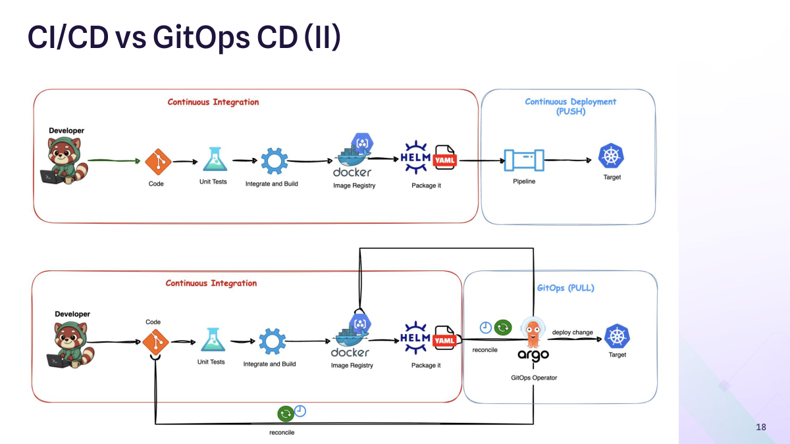

18
CI/CD vs GitOps CD (II)

## Page 19

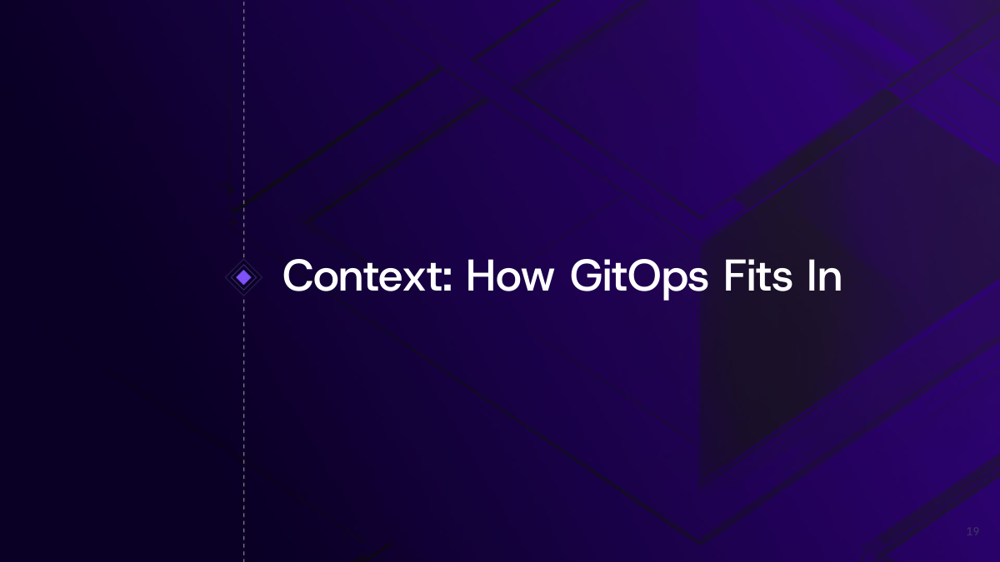

Context: How GitOps Fits In
19

## Page 20

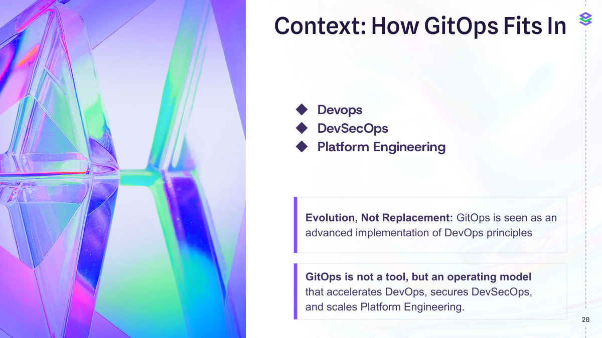

Context: How GitOps Fits In
20
GitOps is not a tool, but an operating model
that accelerates DevOps, secures DevSecOps,
and scales Platform Engineering.
Evolution, Not Replacement: GitOps is seen as an 
advanced implementation of DevOps principles
◆ Devops
◆ DevSecOps
◆ Platform Engineering

## Page 21

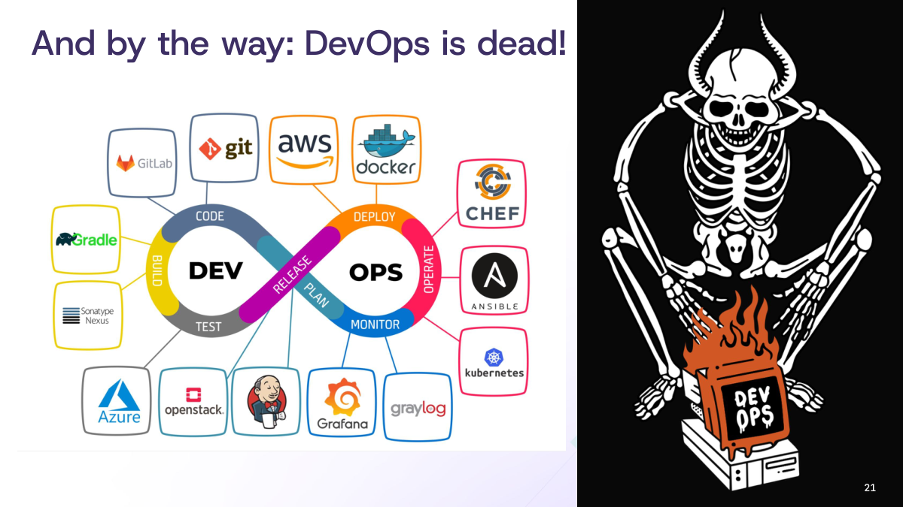

21
And by the way: DevOps is dead!

## Page 22

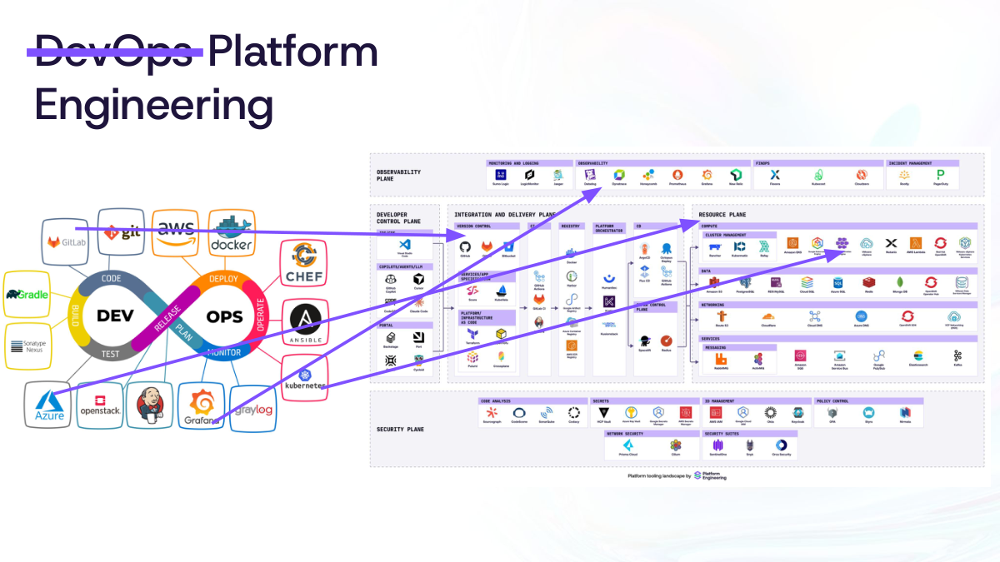

DevOps Platform 
Engineering

## Page 23

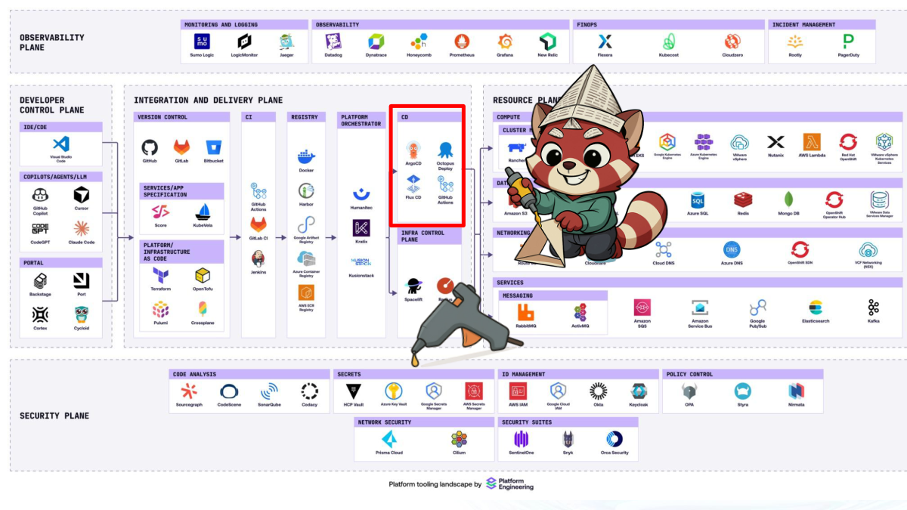

*(no extractable text on this page)*

## Page 24

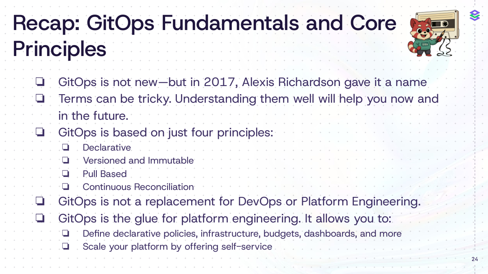

24
Recap: GitOps Fundamentals and Core 
Principles
❏ GitOps is not new—but in 2017, Alexis Richardson gave it a name
❏ Terms can be tricky. Understanding them well will help you now and 
in the future.
❏ GitOps is based on just four principles: 
❏ Declarative 
❏ Versioned and Immutable 
❏ Pull Based 
❏ Continuous Reconciliation
❏ GitOps is not a replacement for DevOps or Platform Engineering.
❏ GitOps is the glue for platform engineering. It allows you to:
❏ Define declarative policies, infrastructure, budgets, dashboards, and more
❏ Scale your platform by offering self-service
