# GitOps for PE Module 6

## Page 1

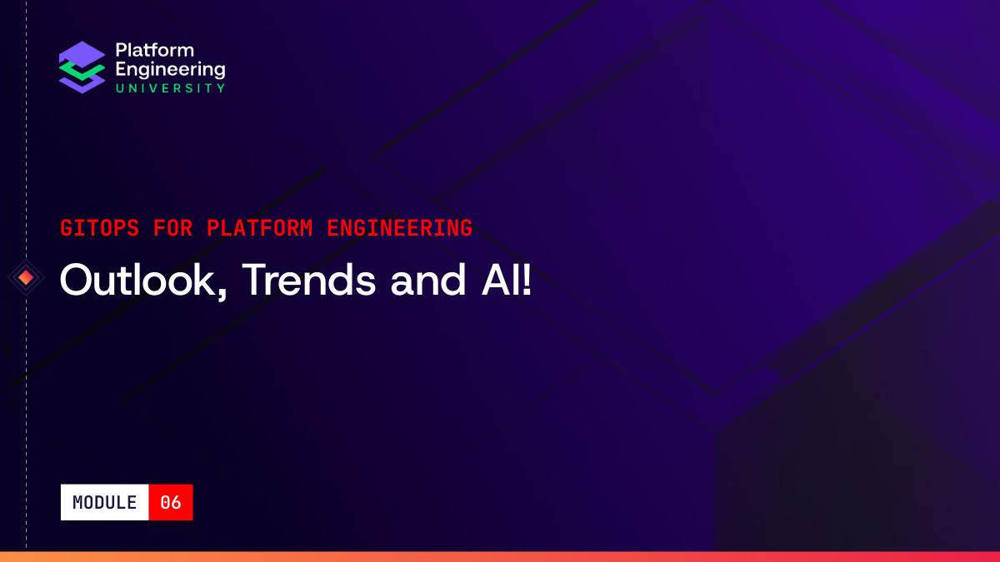

Outlook, Trends and AI!
 
GITOPS FOR PLATFORM ENGINEERING
MODULE 06

## Page 2

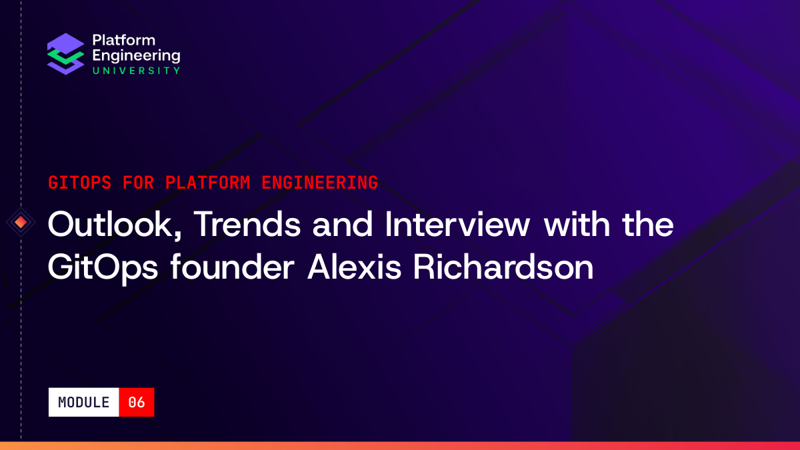

Outlook, Trends and Interview with the 
GitOps founder Alexis Richardson
 
GITOPS FOR PLATFORM ENGINEERING
MODULE 06

## Page 3

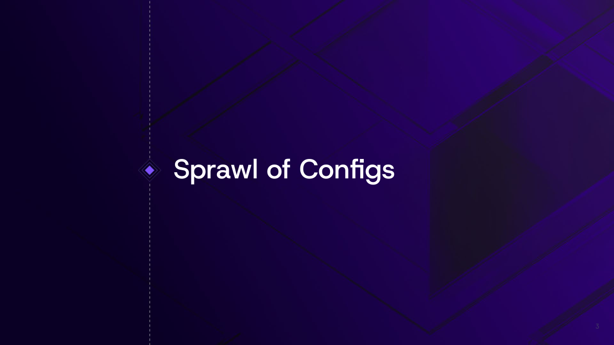

Sprawl of Configs 
3

## Page 4

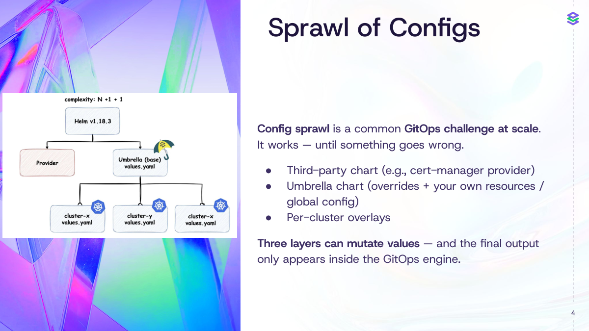

Sprawl of Configs
4
Config sprawl is a common GitOps challenge at scale.
It works — until something goes wrong.
● Third-party chart (e.g., cert-manager provider)
● Umbrella chart (overrides + your own resources / 
global config)
● Per-cluster overlays
Three layers can mutate values — and the final output 
only appears inside the GitOps engine.

## Page 5

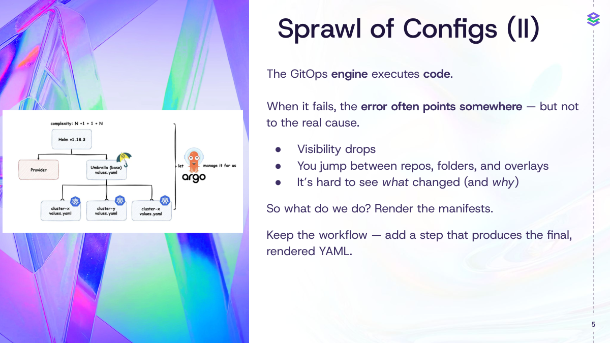

Sprawl of Configs (II)
The GitOps engine executes code.
When it fails, the error often points somewhere — but not 
to the real cause.
● Visibility drops
● You jump between repos, folders, and overlays
● It’s hard to see what changed (and why)
So what do we do? Render the manifests.
Keep the workflow — add a step that produces the final, 
rendered YAML.
5

## Page 6

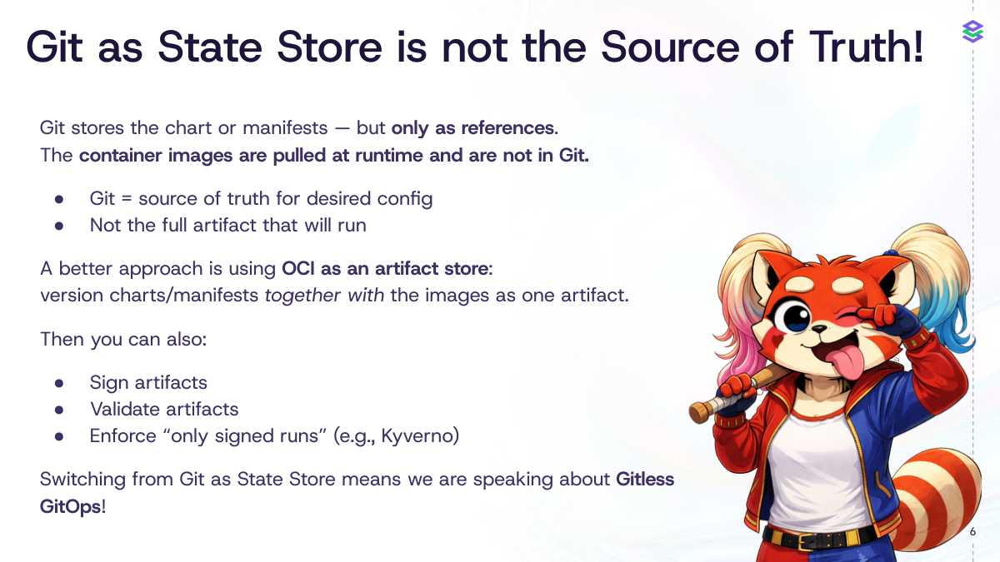

6
Git as State Store is not the Source of Truth!
Git stores the chart or manifests — but only as references.
The container images are pulled at runtime and are not in Git.
● Git = source of truth for desired config
● Not the full artifact that will run
A better approach is using OCI as an artifact store:
version charts/manifests together with the images as one artifact.
Then you can also:
● Sign artifacts
● Validate artifacts
● Enforce “only signed runs” (e.g., Kyverno)
Switching from Git as State Store means we are speaking about Gitless 
GitOps!

## Page 7

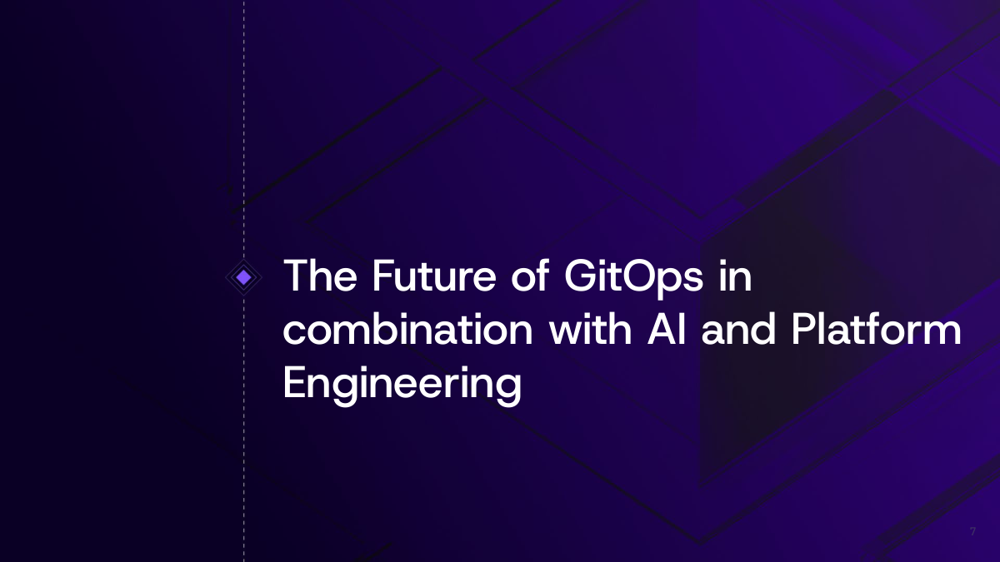

The Future of GitOps in 
combination with AI and Platform 
Engineering
7

## Page 8

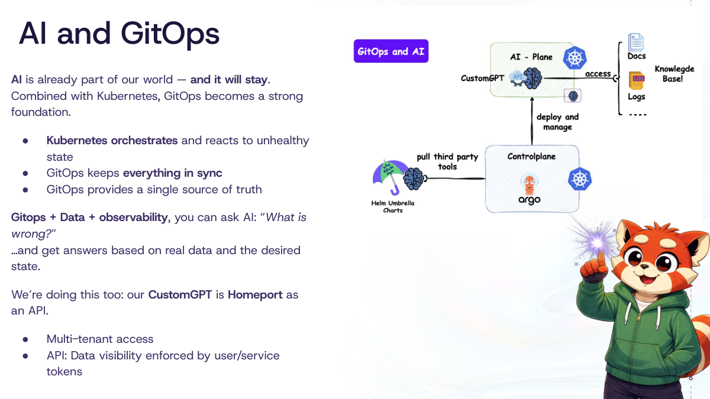

8
AI and GitOps
AI is already part of our world — and it will stay.
Combined with Kubernetes, GitOps becomes a strong 
foundation.
● Kubernetes orchestrates and reacts to unhealthy 
state
● GitOps keeps everything in sync
● GitOps provides a single source of truth
Gitops + Data + observability, you can ask AI: “What is 
wrong?”
…and get answers based on real data and the desired 
state.
We’re doing this too: our CustomGPT is Homeport as 
an API.
● Multi-tenant access
● API: Data visibility enforced by user/service 
tokens

## Page 9

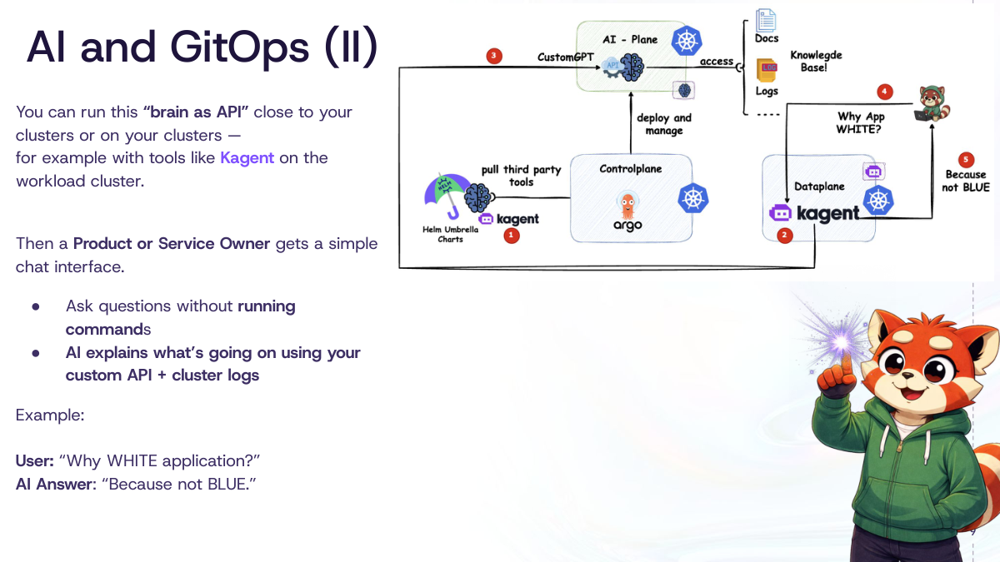

9
AI and GitOps (II)
You can run this “brain as API” close to your 
clusters or on your clusters —
for example with tools like Kagent on the 
workload cluster.
Then a Product or Service Owner gets a simple 
chat interface.
● Ask questions without running 
commands
● AI explains what’s going on using your 
custom API + cluster logs
Example:
User: “Why WHITE application?”
AI Answer: “Because not BLUE.”

## Page 10

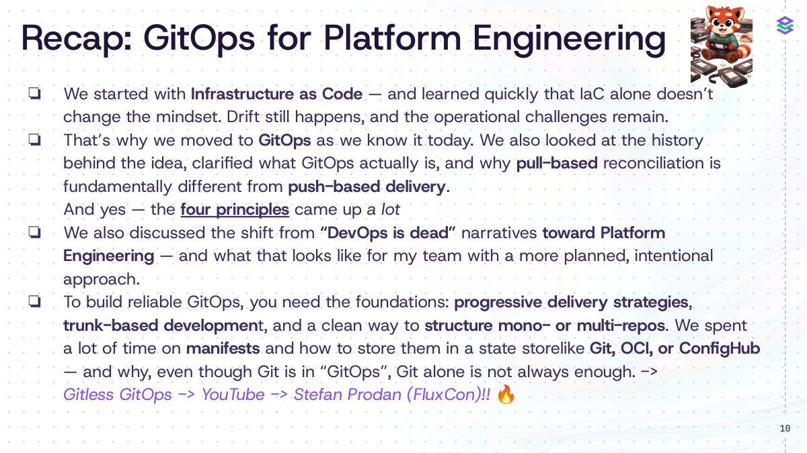

10
Recap: GitOps for Platform Engineering
❏ We started with Infrastructure as Code — and learned quickly that IaC alone doesn’t 
change the mindset. Drift still happens, and the operational challenges remain.
❏ That’s why we moved to GitOps as we know it today. We also looked at the history 
behind the idea, clarified what GitOps actually is, and why pull-based reconciliation is 
fundamentally different from push-based delivery.
And yes — the four principles came up a lot
❏ We also discussed the shift from “DevOps is dead” narratives toward Platform 
Engineering — and what that looks like for my team with a more planned, intentional 
approach.
❏ To build reliable GitOps, you need the foundations: progressive delivery strategies, 
trunk-based development, and a clean way to structure mono- or multi-repos. We spent 
a lot of time on manifests and how to store them in a state storelike Git, OCI, or ConfigHub 
— and why, even though Git is in “GitOps”, Git alone is not always enough. -> 
Gitless GitOps -> YouTube -> Stefan Prodan (FluxCon)!! 🔥

## Page 11

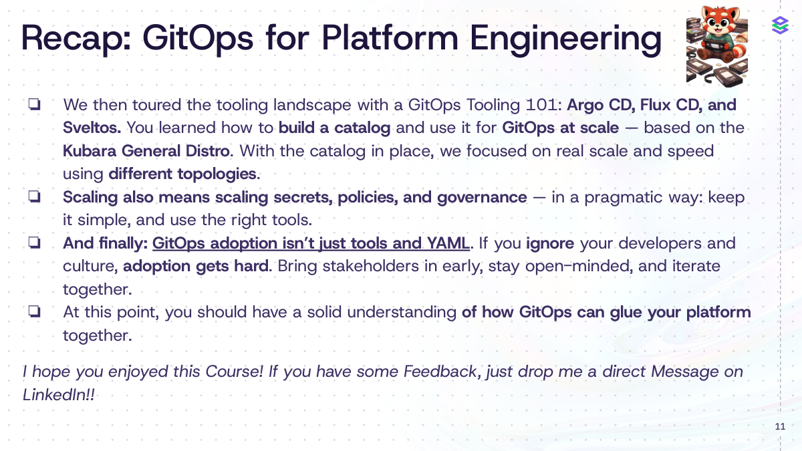

11
Recap: GitOps for Platform Engineering
❏ We then toured the tooling landscape with a GitOps Tooling 101: Argo CD, Flux CD, and 
Sveltos. You learned how to build a catalog and use it for GitOps at scale — based on the 
Kubara General Distro. With the catalog in place, we focused on real scale and speed 
using different topologies.
❏ Scaling also means scaling secrets, policies, and governance — in a pragmatic way: keep 
it simple, and use the right tools.
❏ And finally: GitOps adoption isn’t just tools and YAML. If you ignore your developers and 
culture, adoption gets hard. Bring stakeholders in early, stay open-minded, and iterate 
together.
❏ At this point, you should have a solid understanding of how GitOps can glue your platform 
together.
I hope you enjoyed this Course! If you have some Feedback, just drop me a direct Message on 
LinkedIn!!

## Page 12

12

## Page 13

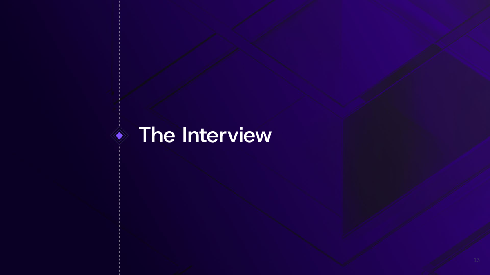

The Interview
13
