# Create your own platform reference architecture Platformengineering.org

## Page 1

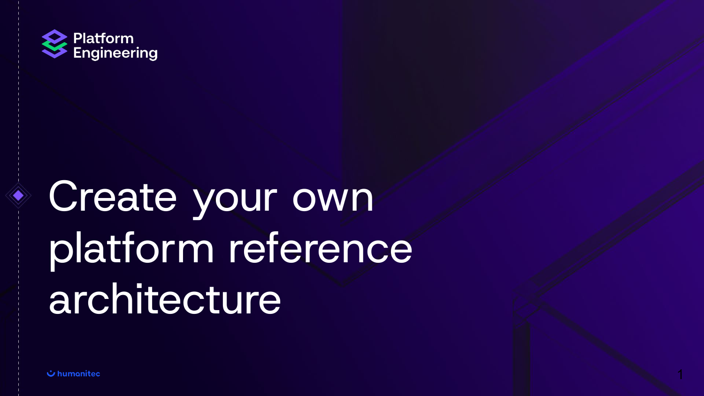

Create your own 
platform reference 
architecture
1

## Page 2

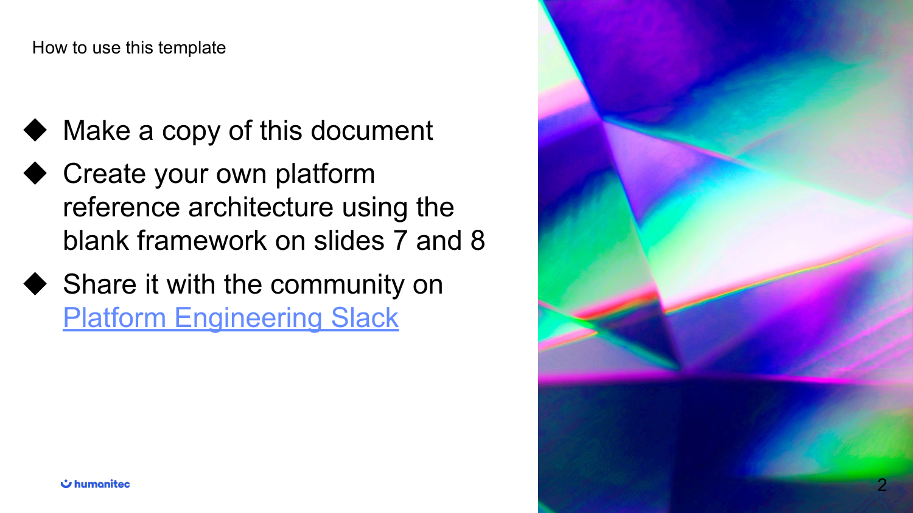

How to use this template
2
◆ Make a copy of this document
◆ Create your own platform 
reference architecture using the 
blank framework on slides 7 and 8
◆ Share it with the community on 
Platform Engineering Slack

## Page 3

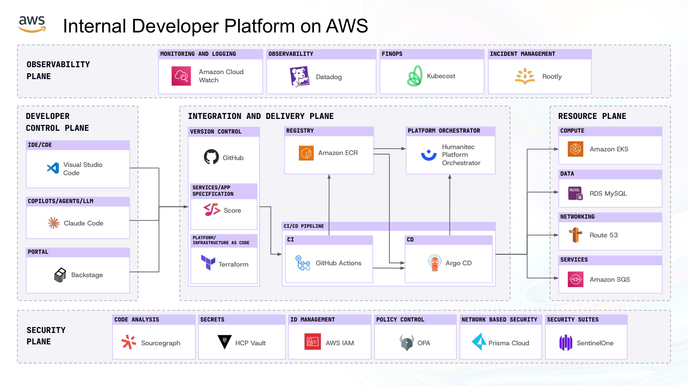

Internal Developer Platform on AWS
Datadog Rootly
OBSERVABILITY 
PLANE
MONITORING AND LOGGING OBSERVABILITY FINOPS INCIDENT MANAGEMENT 
DEVELOPER
CONTROL PLANE 
Visual Studio 
Code
IDE/CDE
COPILOTS/AGENTS/LLM 
Claude Code
PORTAL
Backstage
INTEGRATION AND DELIVERY PLANE 
VERSION CONTROL 
Score
SERVICES/APP 
SPECIFICATION 
Terraform
PLATFORM/
INFRASTRUCTURE AS CODE 
GitHub
Kubecost
RESOURCE PLANE 
COMPUTE
DATA
NETWORKING 
SERVICES
REGISTRY PLATFORM ORCHESTRATOR 
CI/CD PIPELINE 
CDCI
SECURITY
PLANE
CODE ANALYSIS SECRETS ID MANAGEMENT POLICY CONTROL NETWORK BASED SECURITY SECURITY SUITES 
Amazon ECR
GitHub Actions
Humanitec 
Platform 
Orchestrator
Argo CD
Sourcegraph HCP Vault AWS IAM OPA Prisma Cloud SentinelOne
Amazon Cloud 
Watch
Amazon EKS
RDS MySQL
Route 53
Amazon SQS

## Page 4

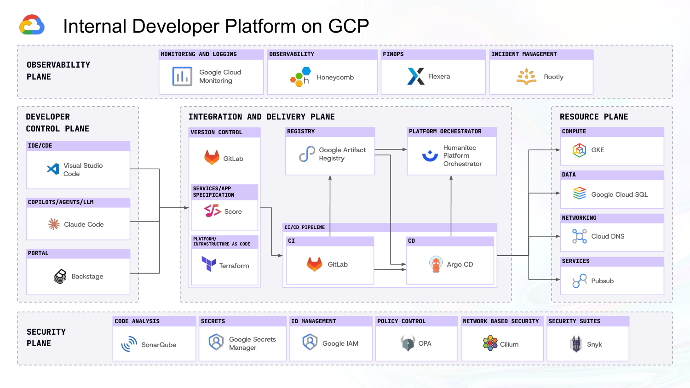

Internal Developer Platform on GCP
Honeycomb Rootly
OBSERVABILITY 
PLANE
MONITORING AND LOGGING OBSERVABILITY FINOPS INCIDENT MANAGEMENT 
DEVELOPER
CONTROL PLANE 
Visual Studio 
Code
IDE/CDE
COPILOTS/AGENTS/LLM 
Claude Code
PORTAL
Backstage
INTEGRATION AND DELIVERY PLANE 
VERSION CONTROL 
Score
SERVICES/APP 
SPECIFICATION 
Terraform
PLATFORM/
INFRASTRUCTURE AS CODE 
GitLab
Flexera
RESOURCE PLANE 
COMPUTE
DATA
NETWORKING 
SERVICES
REGISTRY PLATFORM ORCHESTRATOR 
CI/CD PIPELINE 
CDCI
SECURITY
PLANE
CODE ANALYSIS SECRETS ID MANAGEMENT POLICY CONTROL NETWORK BASED SECURITY SECURITY SUITES 
Google Artifact 
Registry
GitLab
Humanitec 
Platform 
Orchestrator
Argo CD
SonarQube Google Secrets
Manager Google IAM OPA Cilium Snyk
Google Cloud 
Monitoring
GKE
Google Cloud SQL
Cloud DNS
Pubsub

## Page 5

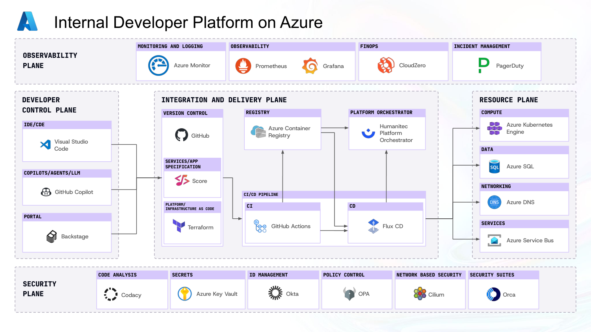

Internal Developer Platform on Azure
Prometheus PagerDuty
OBSERVABILITY 
PLANE
MONITORING AND LOGGING OBSERVABILITY FINOPS INCIDENT MANAGEMENT 
DEVELOPER
CONTROL PLANE 
Visual Studio 
Code
IDE/CDE
COPILOTS/AGENTS/LLM 
GitHub Copilot
PORTAL
Backstage
INTEGRATION AND DELIVERY PLANE 
VERSION CONTROL 
Score
SERVICES/APP 
SPECIFICATION 
Terraform
PLATFORM/
INFRASTRUCTURE AS CODE 
GitHub
CloudZero
RESOURCE PLANE 
COMPUTE
DATA
NETWORKING 
SERVICES
REGISTRY PLATFORM ORCHESTRATOR 
CI/CD PIPELINE 
CDCI
SECURITY
PLANE
CODE ANALYSIS SECRETS ID MANAGEMENT POLICY CONTROL NETWORK BASED SECURITY SECURITY SUITES 
Azure Container 
Registry
GitHub Actions
Humanitec 
Platform 
Orchestrator
Flux CD
Codacy Azure Key Vault Okta OPA Cilium Orca
Azure Monitor
Azure Kubernetes
Engine
Azure SQL
Azure DNS
Azure Service Bus
Grafana

## Page 6

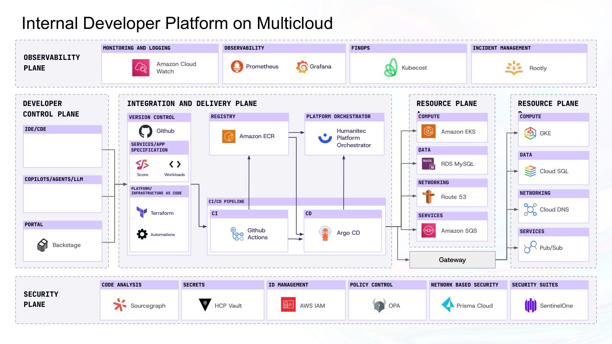

Internal Developer Platform on Multicloud
OBSERVABILITY 
PLANE
DEVELOPER
CONTROL PLANE 
INTEGRATION AND DELIVERY PLANE 
VERSION CONTROL 
Score
SERVICES/APP 
SPECIFICATION 
Terraform
PLATFORM/
INFRASTRUCTURE AS CODE 
Github
RESOURCE PLANE 
BCOMPUTE
DATA
NETWORKING 
SERVICES
REGISTRY PLATFORM ORCHESTRATOR 
CI/CD PIPELINE 
CDCI
SECURITY
PLANE
Amazon ECR
Humanitec 
Platform 
Orchestrator
Argo CD
Workloads
Automations
Github
Actions
RESOURCE PLANE 
ACOMPUTE
DATA
NETWORKING 
SERVICES
Amazon EKS
RDS MySQL
Route 53
Amazon SQS
Gateway
GKE
Cloud SQL
Cloud DNS
Pub/Sub
MONITORING AND LOGGING OBSERVABILITY FINOPS INCIDENT MANAGEMENT 
IDE/CDE
COPILOTS/AGENTS/LLM 
PORTAL
Backstage
Prometheus Grafana
CODE ANALYSIS SECRETS ID MANAGEMENT POLICY CONTROL NETWORK BASED SECURITY SECURITY SUITES 
HCP Vault
Rootly
KubecostAmazon Cloud 
Watch
Sourcegraph AWS IAM OPA Prisma Cloud SentinelOne

## Page 7

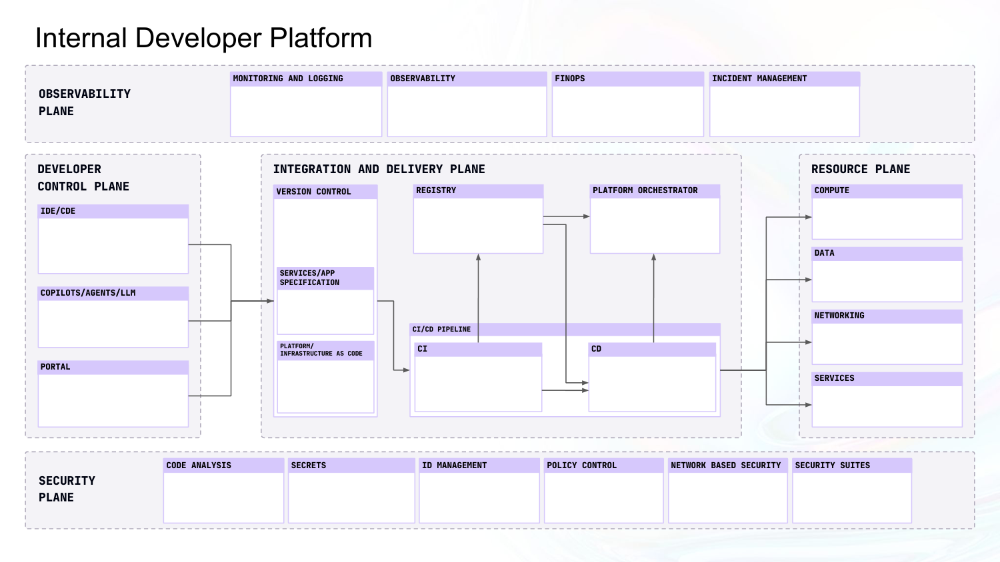

Internal Developer Platform
OBSERVABILITY 
PLANE
MONITORING AND LOGGING OBSERVABILITY FINOPS INCIDENT MANAGEMENT 
DEVELOPER
CONTROL PLANE 
IDE/CDE
COPILOTS/AGENTS/LLM 
PORTAL
INTEGRATION AND DELIVERY PLANE 
VERSION CONTROL 
SERVICES/APP 
SPECIFICATION 
PLATFORM/
INFRASTRUCTURE AS CODE 
RESOURCE PLANE 
COMPUTE
DATA
NETWORKING 
SERVICES
REGISTRY PLATFORM ORCHESTRATOR 
CI/CD PIPELINE 
CDCI
SECURITY
PLANE
CODE ANALYSIS SECRETS ID MANAGEMENT POLICY CONTROL NETWORK BASED SECURITY SECURITY SUITES

## Page 8

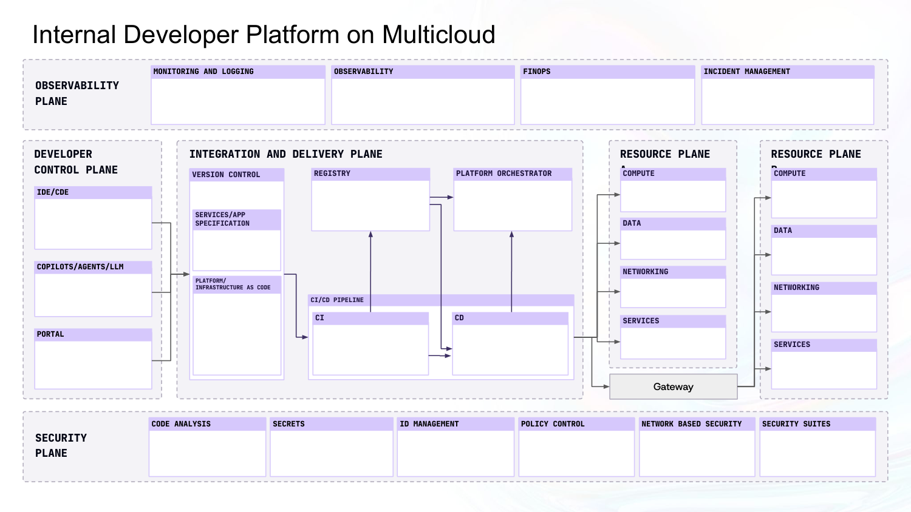

Internal Developer Platform on Multicloud
OBSERVABILITY 
PLANE
DEVELOPER
CONTROL PLANE 
INTEGRATION AND DELIVERY PLANE 
VERSION CONTROL 
SERVICES/APP 
SPECIFICATION 
PLATFORM/
INFRASTRUCTURE AS CODE 
RESOURCE PLANE 
BCOMPUTE
DATA
NETWORKING 
SERVICES
REGISTRY PLATFORM ORCHESTRATOR 
CI/CD PIPELINE 
CDCI
SECURITY
PLANE
RESOURCE PLANE 
ACOMPUTE
DATA
NETWORKING 
SERVICES
Gateway
MONITORING AND LOGGING OBSERVABILITY FINOPS INCIDENT MANAGEMENT 
IDE/CDE
COPILOTS/AGENTS/LLM 
PORTAL
CODE ANALYSIS SECRETS ID MANAGEMENT POLICY CONTROL NETWORK BASED SECURITY SECURITY SUITES

## Page 9

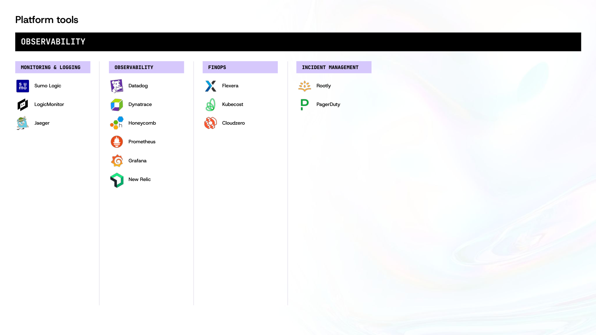

Platform tools
MONITORING & LOGGING 
Sumo Logic
LogicMonitor
Jaeger
OBSERVABILITY
OBSERVABILITY FINOPS INCIDENT MANAGEMENT 
Datadog
Dynatrace
Honeycomb
Prometheus
Grafana
New Relic
Flexera
Kubecost
Cloudzero
Rootly
PagerDuty

## Page 10

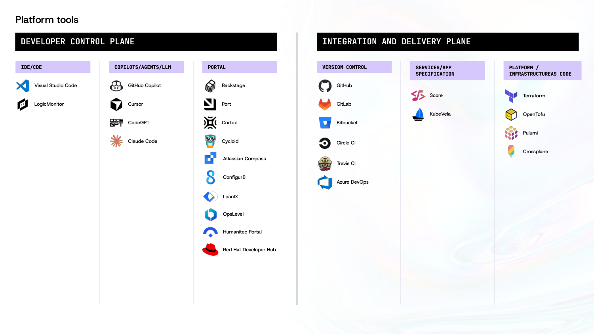

Platform tools
IDE/CDE COPILOTS/AGENTS/LLM PORTAL VERSION CONTROL SERVICES/APP 
SPECIFICATION 
PLATFORM / 
INFRASTRUCTUREAS CODE 
DEVELOPER CONTROL PLANE INTEGRATION AND DELIVERY PLANE
Visual Studio Code
LogicMonitor
GitHub Copilot
Cursor
CodeGPT
Claude Code
Backstage
Port
Cortex
Cycloid
GitHub
GitLab
Bitbucket
Score
KubeVela
Terraform
OpenTofu
Pulumi
Crossplane
Atlassian Compass
Configur8
LeanIX
OpsLevel
Humanitec Portal
Red Hat Developer Hub
Circle CI
Travis CI
Azure DevOps

## Page 11

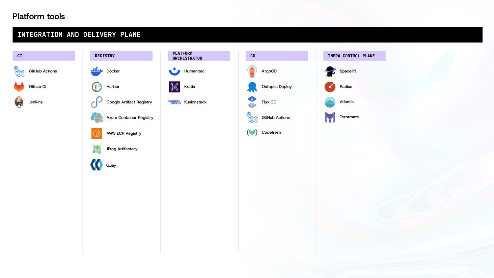

Platform tools
CI REGISTRY PLATFORM 
ORCHESTRATOR CD
INTEGRATION AND DELIVERY PLANE 
INFRA CONTROL PLANE 
GitHub Actions
GitLab CI
Jenkins
Docker
Harbor
Google Artifact Registry
Azure Container Registry
AWS ECR Registry
Humanitec
Kratix
Kusionstack
ArgoCD
Octopus Deploy
Flux CD
GitHub Actions
Spacelift
Radius
JFrog Artifactory
Quay
Codefresh
Atlantis
Terramate

## Page 12

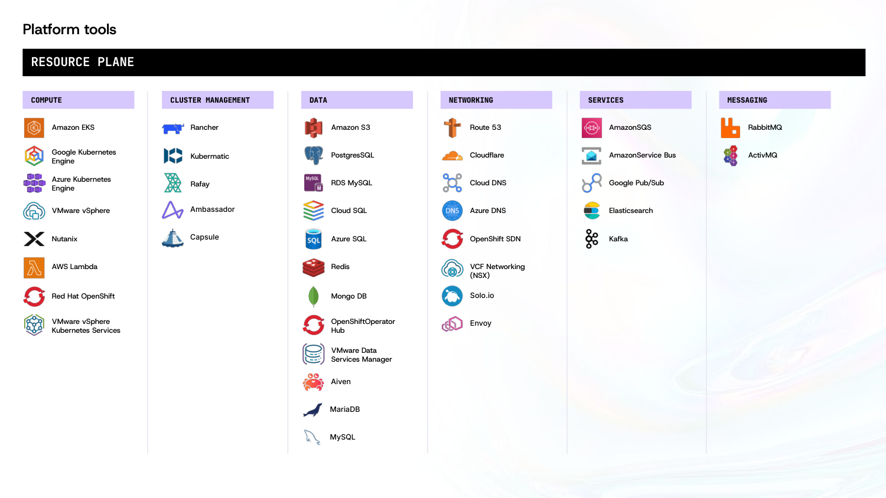

Platform tools
COMPUTE CLUSTER MANAGEMENT DATA NETWORKING 
RESOURCE PLANE
SERVICES MESSAGING
Amazon EKS
Google Kubernetes 
Engine
Azure Kubernetes 
Engine
VMware vSphere
Nutanix
AWS Lambda
Red Hat OpenShift
VMware vSphere 
Kubernetes Services
Rancher
Kubermatic
Rafay
Amazon S3
PostgresSQL
RDS MySQL
Cloud SQL
Azure SQL
Redis
Mongo DB
OpenShiftOperator 
Hub
VMware Data 
Services Manager
Route 53
Cloudflare
Cloud DNS
Azure DNS
OpenShift SDN
VCF Networking 
(NSX)
AmazonSQS
AmazonService Bus
Google Pub/Sub
Elasticsearch
Kafka
RabbitMQ
ActivMQ
Ambassador
Capsule
Aiven 
MariaDB
MySQL
Solo.io
Envoy

## Page 13

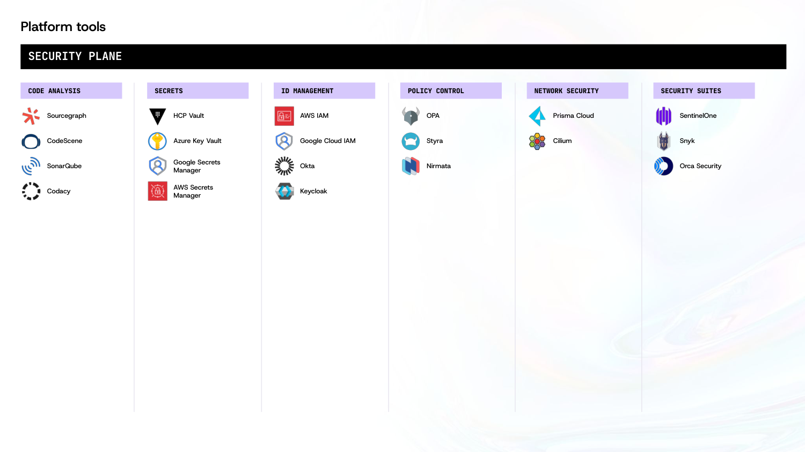

Platform tools
CODE ANALYSIS SECRETS ID MANAGEMENT POLICY CONTROL 
SECURITY PLANE
NETWORK SECURITY SECURITY SUITES 
Sourcegraph
CodeScene
SonarQube
Codacy
HCP Vault
Azure Key Vault
Google Secrets 
Manager
AWS Secrets 
Manager
AWS IAM
Google Cloud IAM
Okta
Keycloak
OPA
Styra
Nirmata
Prisma Cloud
Cilium
SentinelOne
Snyk
Orca Security
